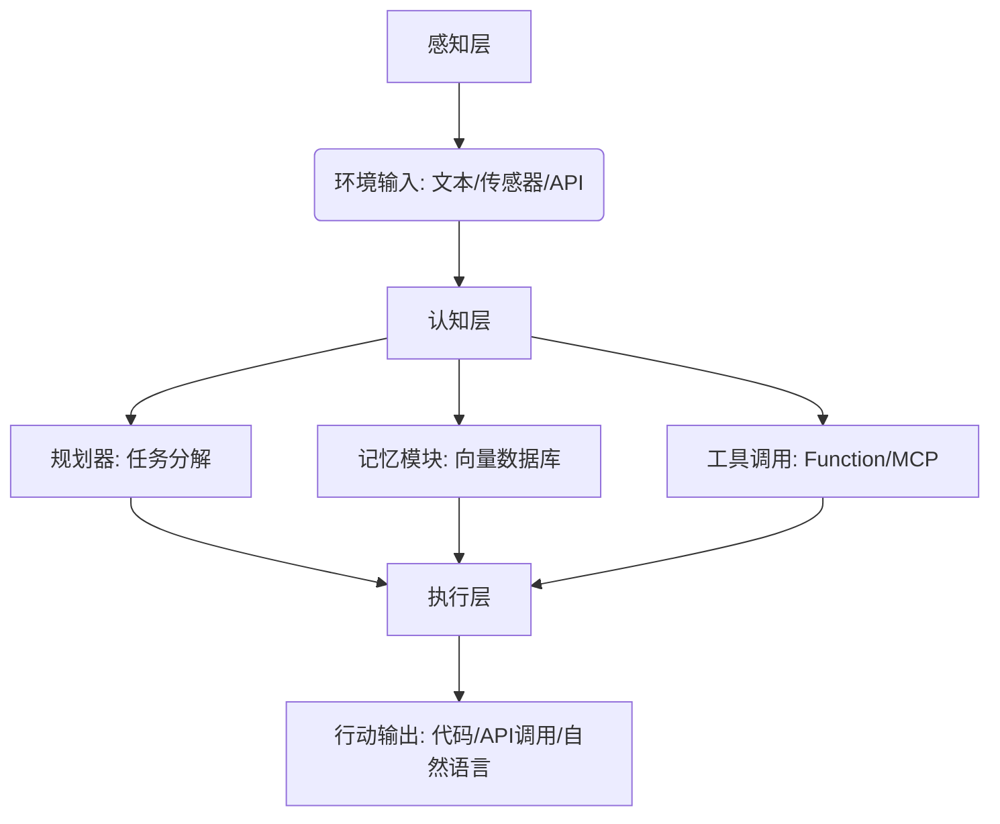
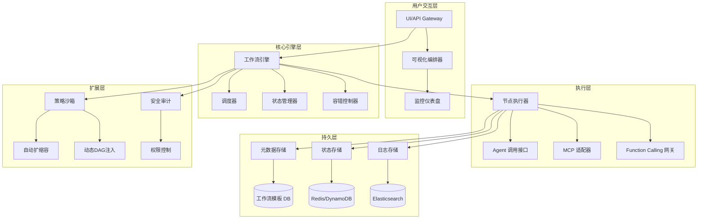
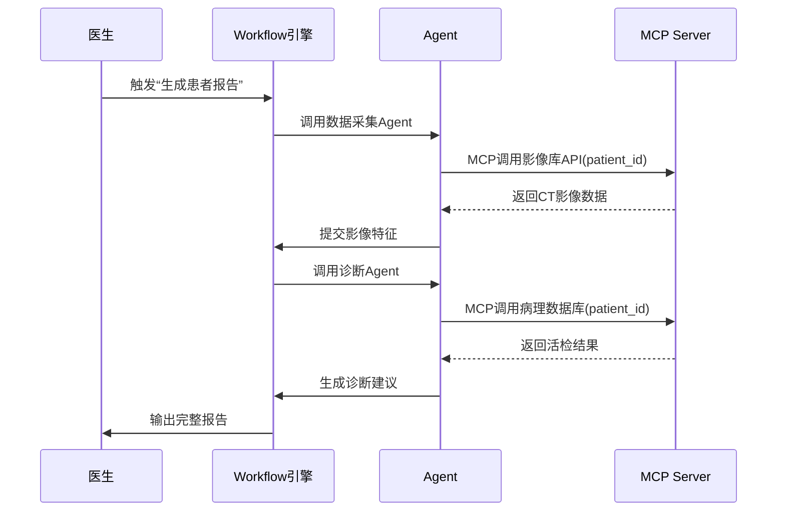

## 什么是 AIGC ？

AIGC，全称为 AI Generated Content，意为“人工智能生成内容”。它指的是利用人工智能技术（尤其是大模型，如GPT、Stable Diffusion等）自动生成文本、图片、音频、视频等多种内容的过程。

## 什么是智能体 Agent ？

智能体 = 自治实体（感知→决策→执行） + 目标导向 + 环境交互  
一个能独立完成任务的“AI员工”。 能够感知环境、推理规划任务、调用工具（MCP Server & Function Call）、从过往经历汲取经验并完成目标。

eg：输入一个“撰写AI趋势报告”的任务后，Agent 像一位熟练的工人，不仅能挑选最合适的工具自动抓取数据、分析内容，还能根据任务需求灵活组和工具完成复杂操作。

Agent 的技术架构分层：

## 什么是工作流 Workflow？

工作流 = 任务编排引擎 + 状态管理 + 异常处理
将多个Agent或工具按有向无环图（DAG）连接，形成自动化流水线（节点编排引擎）。能够跨 Agent 传递数据，流程引擎会按预设规则调度而非 LLMs 自主判断。

Workflow 的技术架构分层：

## 一个「医疗报告生成」工作流的示例：

关键数据流：
所有节点状态由 状态管理器 持久化（避免Agent崩溃导致数据丢失）
MCP调用自动携带 全局ContextID（关联同一患者的多次请求）
