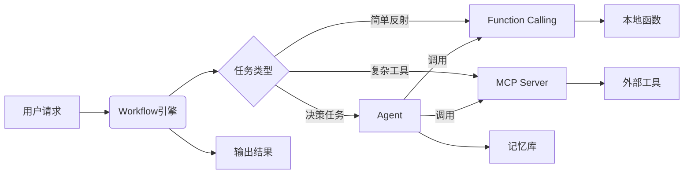
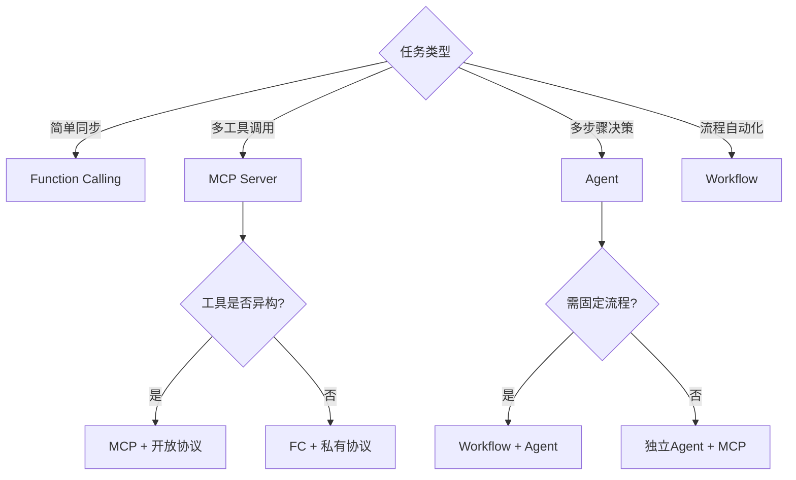
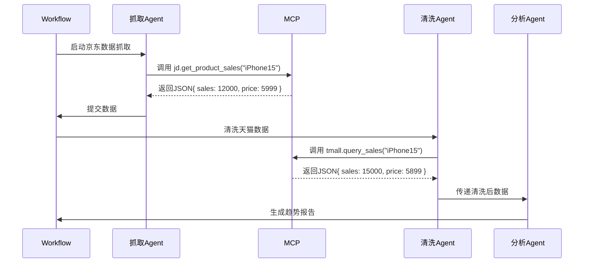

## 什么是函数调用 function calling？

一种机制，允许大语言模型 LLM 直接调用预定义函数的能力，允许模型生成参数并整合结果。

解决大模型两大缺陷：

- 没有最新信息，不具备时效性。
- 没有真正的逻辑，本质上是概率学。

> eg：向 LLM 发送以下提示：“特斯拉当前的股价是多少？”
>
> 得到的答案要么是“幻觉”，要么是“我没有实时数据，无法告诉你”。

FC 的特点：

- 极快（无网络延迟）
- 固定模式（输入输出明确）
- 不依赖记忆（单次调用）

## 什么是模型上下文协议 MCP ？

MCP，全称为 Model Context Protocol，是一个开源的协议标准。

## 为什么需要 MCP ？

为了整个 AI 行业的生态发展，作为一种标准出现是必然需求，解决了三个关键问题：

1. 数据孤岛：让 AI 可以链接万物
2. 开发低效：解决为每个 LLM 写 Function Call 的问题，一次编写所有大模型可用
3. 生态碎片化：作为一种标准让不同厂商可以即插即用
4. 支持复杂工作流与状态管理：Function Calling 难以维护多轮对话的中间状态（eg：用户查询航班后需手动传递航班号预定）

| 维度       | 传统模式                 | MCP 模式                 | 变革价值                  |
| ---------- | ------------------------ | ------------------------ | ------------------------- |
| 集成成本   | 每次对接新工具需定制开发 | 一次开发，全网复用       | 开发效率提升 10倍         |
| 功能范围   | 单一工具调用             | 多工具协同执行复杂任务链 | AI 从"助手"升级为"执行者" |
| 生态开放性 | 封闭式 API 被厂商卡      | 开源协议，社区共建工具库 | 催生 "AI 应用商店" 模式   |
| 安全可控性 | API 密钥暴露风险         | 数据不离域，权限分级管控 | 满足企业级合规需求        |

## MCP 架构和执行流程？

架构分为以下 3 部分：

- 客户端：大模型应用（DeepSeek、ChatGPT）发起请求
- 服务器：中间层，连接具体工具（数据库、设计软件）
- 资源：具体的数据或工具（Excel文件、网页 API）

运行流程：

1. 初始化与工具列表获取：

   - 用户首先启动 MCPClient，完成初始化操作。
   - MCPClient 向 MCPServer 发送 GET /tools/list 请求，获取可用工具的元数据。
   - MCPServer 返回包含工具名称、功能描述、参数要求等信息的 工具列表JSON，供客户端后续构建提示词使用。

2. 用户输入与提示词构建：

   - 用户通过 MCPClient 输入自然语言请求（如“查询服务器状态”“生成文件报告”等）。
   - MCPClient 将用户请求与初始化阶段获取的 工具列表 结合，生成包含任务目标和工具能力的提示词（Prompt），传递给 LLMService（大语言模型服务层）。

3. 工具传递方式选择（二选一）：

   - 使用 Function Call（函数调用）直接携带工具列表信息。LLMService 通过 LLM_API 调用大语言模型时，在请求中直接携带 工具schema（结构化工具定义，如参数格式、调用格式），告知模型可用工具的调用方式。
   - 在系统提示词（System Prompt）中包含工具列表。LLMService 将工具列表以自然语言描述形式嵌入 系统提示词（System Prompt），让模型在理解用户需求时知晓可用工具的功能边界。

4. LLM判断与响应：

   - 无需工具：LLM直接将处理结果通过 MCP Client 回复给用户；
   - 需要工具：
     1. 获取命令模板： MCP Client 根据模型指定的工具名称，在初始化时保存的工具配置中取出对应的 命令模板（如Shell命令格式、API调用参数模板）。
     2. 生成与执行命令： MCP Client 将用户输入参数与命令模板结合，通过 ToolService（工具执行服务）生成完整可执行命令，并提交给 本地系统 执行。
     3. 结果处理：本地系统 返回原始执行结果（如命令输出文本、API返回数据），ToolService 将其转换为结构化结果（JSON），反馈给 MCP Client。
     4. 二次调用模型生成最终回复：MCPClient 将结构化结果与用户原始问题一并提交给 LLMService，通过 LLM_API 调用模型，将技术化的执行结果转化为自然语言描述（如将“服务器CPU使用率80%”转化为“当前服务器CPU负载较高，建议检查进程”）。

5. 工具命令生成与执行：
   若需要工具， MCP Client 根据 LLM 提供的参数格式，以及 MCP Server 配置的命令模板进行拼接，生成完整的可执行命令，并在本地环境（Local_Env）中执行该命令。

6. 结果处理与输出：
   本地环境执行命令后，将结果返回给 MCP Client。MCP Client 将执行结果提交给 LLM，由 LLM 对技术化的执行结果进行处理，最终以人性化的语言形式输出给用户。


## 什么是 MCP Client ？

一个 LLM 的遥控器，负责向 Server 发送指令并接受结果。充当翻译官的角色，把自然语言指令转换成 Server 能理解的请求格式。
它主要做三件事：

1. 构建请求：根据用户输入或 LLM 的需求构建出符合 MCP 协议的消息
2. 与 Server 通信：与 Server 建立连接并发送请求
3. 接受到 Server 返回的结果后解读这些信息并反馈给用户或者 LLM


## 什么是 MCP Server ？

一个工具箱，里面装满了各种工具（如爬虫、文件读写、数据库查询），但它不会主动使用这些工具，它允许大语言模型以一种标准化的方式调用。
它主要做三件事：

1. 提供工具：核心价值
2. 处理请求：收到 client 的请求后负责解析并根据请求内容执行相应的操作
3. 返回结果：完成操作后把结果返回给 client

## 什么是 MCP Host ？

承载 MCP Server 的底层基础设施，负责提供协议运行所需的计算、存储与安全环境。一个 Host 托管多个 Server 实现资源隔离与多租户支持。
它使 Server 能专注业务逻辑，而无需关心底层运维复杂性，Host 层的设计质量直接决定整个系统的稳定性上限。
它主要做五件事：

1. 资源供给与隔离：为每个 MCP Server 实例分配独立资源
2. 生命周期管理：启动、停止、热更新
3. 网络与安全沙箱：
   - 防火墙规则（限制 Server 的出口 IP）
   - TLS 终端卸载（由 Host 统一处理加密）
   - 防止 Server 逃逸攻击（如 gVisor 容器隔离）
   ```mermaid
   graph LR
   Client -->|HTTPS| Host
   Host -->|解密 & 协议检查| Server
   Server -->|内部通信| Tool[业务工具]
   ```
4. 监控与自愈：
   - 监控CPU/内存利用率（阈值超限自动扩容）
   - 监控QPS/延迟（异常流量自动熔断）
   - Server 崩溃时自动重启
   - 检测到内存泄漏时重建实例
5. 跨 Server 协调：全局配额控制、跨工具事务、工具依赖管理都在 Host 层协调实现
6. 混合云桥接：统一管理部署在公有云 + 私有云 + 边缘端的 MCP Server

```text
MCP Client → 调用服务（如 Agent 请求天气接口）
       ↓
MCP Server → 处理协议（路由到天气API + 管理会话）
       ↓
MCP Host  → 提供资源（CPU/内存/网络隔离）
       ↓
External Tools → 实际执行（天气API）
```

## 基于 AI 编写 MCP Server

```text
### 需求

基于提供的 MCP 相关资料，帮我构建一个 MCP Server，需求如下：

- 提供一个获取当前时间的工具
- 接收时区作为参数（可选）
- 编写清晰的注释和说明
- 要求功能简洁、只包含关键功能
- 使用 TypeScript 编写

请参考下面四个资料：

### [参考资料 1] MCP 基础介绍

- 粘贴 https://modelcontextprotocol.io/introduction 里的内容。

### [参考资料 2] MCP 核心架构

- 粘贴 https://modelcontextprotocol.io/docs/concepts/architecture 里的内容。

### [参考资料 3] MCP Server 开发指引

- 粘贴 https://modelcontextprotocol.io/quickstart/server 里的内容。

### [参考资料 4] MCP Typescript SDK 文档

- 粘贴 https://github.com/modelcontextprotocol/typescript-sdk/blob/main/README.md 里的内容。
```

## 通讯协议 STDIO（标准输入输出）和 SSE（服务器推送事件）有什么区别？

- STDIO 协议是「面对面对话」把 MCP Server 也就是这个 Python 程序下载到本机并且本机运行，AI 客户端与 MCP Server 使用 STDIO 也就是操作系统的标准输入输出通道进行交互，无需网络连接。AI 客户端与 MCP Server 的距离更近一些。

- SSE 协议是「电话热线」把 MCP Server 也就是这个 Python 程序单独部署，AI 客户端与 MCP Server 使用 SSE 协议进行远程调用。AI 客户端与 MCP Server 的距离更远一些。

## Function Calling 和 MCP Server 和 Agent 和 Workflow 有什么区别？

| 维度       | Function Calling                             | MCP Server                                   | Agent                                       | Workflow                             |
| ---------- | -------------------------------------------- | -------------------------------------------- | ------------------------------------------- | ------------------------------------ |
| 本质定位   | 模型内置的轻量级工具调用接口（内部触发）     | 标准化的外部工具通信协议层（双向通信）       | 自主决策的任务执行实体（规划+工具调度）     | 任务编排引擎（多节点调度与状态管理） |
| 协议性质   | 厂商私有（如OpenAI/Anthropic自定义格式）     | 开放标准（JSON-RPC 2.0等）                   | 无固定协议（可集成FC/MCP/自定义逻辑）       | 依赖 DSL/YAML （Prefect/Airflow）    |
| 架构设计   | 集成于模型内部，直接生成函数调用指令         | 分层架构（客户端-服务端解耦）                | 多模块协同（规划器+工具库+记忆模块）        | 有向无环图（DAG）驱动节点依赖        |
| 上下文管理 | 需开发者手动维护多轮对话状态                 | 原生支持跨轮次参数传递与状态存储             | 主动维护任务链状态（自动记忆/回溯关键信息） | 全局状态跟踪（节点间数据持久化）     |
| 安全机制   | 依赖业务层实现权限控制                       | 内置会话加密、权限分级等企业级安全管控       | 沙箱隔离+运行时监控（防越权/死循环）        | 权限分级+审计日志                    |
| 使用场景   | 简单同步任务（天气查询、计算器、知识库问答） | 复杂异步工作流（跨系统数据聚合、多步骤决策） | 长周期目标导向任务（旅行规划）              | 流程化作业（订单处理/报告生成）      |

四者关系本质是：  
能力（FC）→ 连接（MCP）→ 思考（Agent）→ 行动（Workflow）



Function Calling = 神经末梢反射
→ 特性：快速、无意识、局部的

MCP Server = 工具握柄
→ 特性：标准化、安全、可扩展的

Agent = 大脑
→ 特性：决策、规划、自主的

Workflow = 神经中枢
→ 特性：编排、状态化、流程驱动的

## 决策树



### 一个「对比 iPhone 15 在京东和天猫的月销量，并分析价格趋势」的需求分析实例：

技术分工：

| 组件     | 职责                                                                                                     |
| -------- | -------------------------------------------------------------------------------------------------------- |
| Workflow | 编排流程：竞品抓取 → 数据清洗 → 趋势分析 → 报告生成                                                      |
| Agent 群 | - 抓取Agent：控制爬虫 <br> - 清洗Agent：过滤无效数据 <br> - 分析Agent：调用统计模型                      |
| MCP      | 封装：<br> - 京东数据API → jd.get_product_sales(item_id) <br> - 天猫数据API → tmall.query_sales(item_id) |

执行流程如图：


