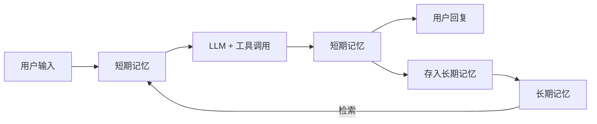

# 背景

记忆系统可以使 AI Agent 像人类一样，在单次对话中保持上下文连贯性（短期记忆），同时能够跨会话记住用户偏好、历史交互和领域知识（长期记忆）。
记忆使它们能够记住之前的互动、从反馈中学习，并适应用户的偏好。

# 记忆的定义

习惯上，可以将会话级别的历史消息称为短期记忆，把可以跨会话共享的信息称为长期记忆。

- 会话级记忆：用户和智能体 Agent 在一个会话中的多轮交互（user-query & response）
- 跨会话记忆：从用户和智能体 Agent 的多个会话中抽取的通用信息，可以跨会话辅助 Agent 推理

本质上两者并不是通过简单的时间维度进行的划分，从实践层面上以是否跨 Session 会话来进行区分。
长期记忆的信息从短期记忆中抽取提炼而来，根据短期记忆中的信息实时地更新迭代，而其信息又会参与到短期记忆中辅助模型进行个性化推理。

# Agent 框架集成记忆的通用模式

1. 推理前加载- 根据当前 user-query 从长期记忆中加载相关信息
2. 上下文注入- 从长期记忆中检索的信息加入当前短期记忆中辅助模型推理
3. 记忆更新- 短期记忆在推理完成后加入到长期记忆中
4. 信息处理- 长期记忆模块中结合 LLM+向量化模型进行信息提取和检索



# 短期记忆

短期记忆存储会话中产生的各类消息，包括用户输入、模型回复、工具调用及其结果等。
这些消息直接参与模型推理，实时更新，并受模型的 maxToken 限制。
当消息累积导致上下文窗口超出限制时，需要通过上下文工程策略（压缩、卸载、摘要等）进行处理，这也是上下文工程主要处理的部分。

### 短期记忆的核心特点：

- 存储会话中的所有交互消息（用户输入、模型回复、工具调用等）
- 直接参与模型推理，作为 LLM 的输入上下文
- 实时更新，每次交互都会新增消息
- 受模型 maxToken 限制，需要上下文工程策略进行优化

### 短期记忆的上下文工程策略

短期记忆直接参与 Agent 和 LLM 的交互，随着对话历史增长，上下文窗口会面临 token 限制和成本压力。
上下文工程策略旨在通过智能化的压缩、卸载和摘要技术，在保持信息完整性的同时，有效控制上下文大小。

需要说明的是，各方对上下文工程的概念和理解存在些许差异：

- 狭义的上下文工程特指对短期记忆（会话历史）中各种压缩、摘要、卸载等处理机制，主要解决上下文窗口限制和 token 成本问题；
- 广义的上下文工程则包括更广泛的上下文优化策略，如非运行态的模型选择、Prompt 优化工程、知识库构建、工具集构建等。

这些都是在模型推理前对上下文进行优化的手段，且这些因素都对模型推理结果有重要影响。

### 针对短期记忆的上下文处理，主要有以下几种策略：

1. 上下文缩减（Context Reduction） ：上下文缩减通过减少上下文中的信息量来降低 token 消耗，主要有两种方法：
   1. 保留预览内容：对于大块内容，只保留前 N 个字符或关键片段作为预览，原始完整内容被移除
   2. 总结摘要：使用 LLM 对整段内容进行总结摘要，保留关键信息，丢弃细节
2. 上下文卸载（Context Unloading） ：主要解决被缩减的内容是否可恢复的问题。当内容被缩减后，原始完整内容被卸载到外部存储（如文件系统、数据库等），消息中只保留最小必要的引用（如文件路径、UUID 等）。当需要完整内容时，可以通过引用重新加载。优势在于上下文更干净，占用更小，信息不丢，随取随用。适用于网页搜索结果、超长工具输出、临时计划等占 token 较多的内容。
3. 上下文隔离（Context Isolation）：通过多智能体架构，将上下文拆分到不同的子智能体中（类似单体拆分称多个微服务）。主智能体编写任务指令，发送给子智能体，子智能体的整个上下文仅由该指令组成。子智能体完成任务后返回结果，主智能体不关心子智能体如何执行，只需要结果。优势在于上下文小、开销低、简单直接。适用于任务有清晰简短的指令，只有最终输出才重要，如代码库中搜索特定片段。

### 策略选择原则

- 时间远近：近期消息通常更重要，需要优先保留；历史消息可以优先进行缩减或卸载；
- 数据类型：不同类型的消息（用户输入、模型回复、工具调用结果等）重要性不同，需要采用不同的处理策略；
- 信息可恢复性：对于需要完整信息的内容，应优先使用卸载策略；对于可以接受信息丢失的内容，可以使用缩减策略

# 长期记忆

长期记忆与短期记忆形成双向交互：一方面，长期记忆从短期记忆中提取“事实”、“偏好”、“经验”等有效信息进行存储（Record）；
另一方面，长期记忆中的信息会被检索并注入到短期记忆中，辅助模型进行个性化推理（Retrieve）。

要实现这两个核心流程，需要以下组件：

1. LLM 大模型：提取短期记忆中的有效信息（记忆的语义理解、抽取、决策和生成）；
2. Embedder 向量化：将文本转换为语义向量，支持相似性计算；
3. VectorStore 向量数据库：持久化存储记忆向量和元数据，支持高效语义检索；
4. GraphStore 图数据库：存储实体-关系知识图谱，支持复杂关系推理；
5. Reranker（重排序器）：对初步检索结果按语义相关性重新排序；
6. SQLite：记录所有记忆操作的审计日志，支持版本回溯；

### Record

```text
LLM 事实提取 → 信息向量化 → 向量存储 →（复杂关系存储）→ SQLite 操作日志
```

### Retrieve

```text
User query 向量化 → 向量数据库语义检索 → 图数据库关系补充 →（Reranker-LLM）→ 结果返回
```

### 与短期记忆的交互

- Record（写入）：从短期记忆的会话消息中提取有效信息，通过LLM进行语义理解和抽取，存储到长期记忆中
- Retrieve（检索）：根据当前用户查询，从长期记忆中检索相关信息，注入到短期记忆中作为上下文，辅助模型推理

### 实践中的实现方式

在 Agent 开发实践中，长期记忆通常是一个独立的第三方组件，因为其内部有相对比较复杂的流程（信息提取、向量化、存储、检索等）。
常见的长期记忆组件包括 Mem0、Zep、Memos、ReMe 等，这些组件提供了完整的 Record 和 Retrieve 能力，Agent 框架通过 API 集成这些组件。

### 信息组织维度

用户维度（个人记忆）：面向用户维度组织的实时更新的个人知识库

- 用户画像分析报告
- 个性化推荐系统，千人千面
- 处理具体任务时加载至短期记忆中

业务领域维度：沉淀的经验（包括领域经验和工具使用经验）

- 可沉淀至领域知识库
- 可通过强化学习微调沉淀至模型

### 长期记忆与 RAG 的区别

| 对比条目     | RAG                                                            | 长期记忆                                                                   |
| ------------ | -------------------------------------------------------------- | -------------------------------------------------------------------------- |
| **主要目的** | 为大模型提供外部知识，弥补训练数据的局限性（如时效性、专业性） | 为 AI Agent 记录并利用特定用户的历史交互信息，实现个性化、上下文连续的服务 |
| **服务对象** | 全体用户或任务                                                 | 特定用户或会话主体（高度个性化）                                           |
| **知识来源** | 结构化/非结构化文档（如 PDF、网页、数据库）                    | 用户与 Agent 的对话历史、行为日志等                                        |

技术层面的相似点：

1. 向量化存储：都将文本内容通过 Embedding 模型转为向量，存入向量数据库；
2. 相似性检索：在用户提问时，将当前 query 向量化，在向量库中检索 top-k 最相关的条目；
3. 注入上下文生成：将检索到的内容注入到模型交互上下文中，辅助 LLM 生成最终回答；

### 长期记忆的关键问题

一、准确性

记忆的准确性包含两个层面：

- 有效的记忆管理：需要具备智能的巩固、更新和遗忘机制，这主要依赖于记忆系统中负责信息提取的模型能力和算法设计；
- 记忆相关性的检索准确度：主要依赖于向量化检索&重排的核心能力；

核心挑战：

- 记忆的建模：需要完善强大的用户画像模型；
- 记忆的管理：基于用户画像建模算法，提取有效信息，设计记忆更新机制；
- 向量化相关性检索能力：提升检索准确率和相关性；

二、安全和隐私

记忆系统记住了大量用户隐私信息，如何防止数据中毒等恶意攻击，并保障用户隐私，是必须解决的问题。

核心挑战：

- 数据加密与访问控制
- 防止恶意数据注入
- 透明的数据管理机制
- 用户对自身数据的掌控权

三、多模态记忆

支持文本记忆、视觉、语音仍被孤立处理，如何构建统一的“多模态记忆空间”仍是未解难题。

核心挑战：

- 跨模态关联
- 与检索统一的多模态记忆表示
- 毫秒级响应能力

### 长期记忆开源产品对比

| 产品                | 开源时间  | 功能（记忆类型）               | LLM的作用           | 向量数据库                | 图数据库              |
| ------------------- | --------- | ------------------------------ | ------------------- | ------------------------- | --------------------- |
| **Mem0**            | 2023年7月 | ✅ 用户画像 + 领域记忆         | 记忆创建/更新/检索  | ✅ pgvector, Qdrant等多种 | ✅ Neo4j, Memgraph    |
| **Zep**             | 2023年初  | ✅ 用户画像 + 领域记忆         | 记忆提取 + 实体识别 | ✅ 支持                   | ✅ 时序知识图谱架构   |
| **MemOS**           | 2025年7月 | ✅ 用户画像 + 领域记忆         | 记忆提取 + 推理     | ⚠️ 可选支持，非必需       | ✅ NebulaGraph, Neo4j |
| **Memobase**        | 2025年1月 | ✅ 用户画像记忆<br>❌ 领域记忆 | 画像理解 + 更新     | ❌ 不依赖向量数据库       | ❌ 不依赖图数据库     |
| **AgentScope ReMe** | 2025年6月 | ✅ 用户画像 + 领域记忆         | 记忆管理 + 优化     | ✅ Chroma, Qdrant等多种   | ❌ 未明确提及         |

# mem0("mem-zero")

## 自托管

1、安装 Mem0

```shell
pip install mem0ai openai
```

2、一个小的 demo

```python
from openai import OpenAI
from mem0 import Memory

openai_client = OpenAI()
memory = Memory()

def chat_with_memories(message: str, user_id: str = "default_user") -> str:

    # 检索相关记忆
    relevant_memories = memory.search(query=message, user_id=user_id, limit=3)
    memories_str = "\n".join(f"- {entry['memory']}" for entry in relevant_memories["results"])

    # 生成助手回复
    system_prompt = f"你是我的私人助理，请根据我的记忆回答我的问题。\n我的记忆：\n{memories_str}"
    messages = [{"role": "system", "content": system_prompt}, {"role": "user", "content": message}]
    response = openai_client.chat.completions.create(model="gpt-4o-mini", messages=messages)
    assistant_response = response.choices[0].message.content

    # 从对话中创建新记忆
    messages.append({"role": "assistant", "content": assistant_response})
    memory.add(messages, user_id=user_id)

    return assistant_response

def main():
    while True:
        user_input = input("用户：").strip()
        if user_input.lower() == 'exit':
            print("再见！")
            break
        print(f"系统：{chat_with_memories(user_input, "zhangsan")}")

if __name__ == "__main__":
    main()

```

特点：  
用户不再关注和拼接历史会话，每次用户请求进来后，先检索记忆，然后将记忆带到系统 Prompt 中回答用户问题，最后再将这次对话保存到记忆，以此循环往复。

注意：  
上面这个记忆保存在内存里，只是临时的，重启程序后记忆就没有了。

## 平台托管

进入 Mem0 平台，注册后，根据提示步骤获取 API KEY。

修改 demo 代码：

```python
from mem0 import MemoryClient
memory = MemoryClient(api_key=os.getenv("MEM0_API_KEY"))
```

这样就可以把记忆保存在 Mem0 服务中，就算程序重启，记忆也不会丢失。

可以在 Mem0 平台的 “Memories” 页面查看保存的记忆。

## 记忆存储原理

- 提取阶段（Extraction）
- 更新阶段（Update）

### 提取阶段

关注信息：

1. 最新的一轮对话，通常由用户消息和助手响应组成；
2. 滚动摘要，从向量数据库检索得到，代表整个历史对话的语义内容；
3. 最近的 m 条消息，提供了细粒度的时间上下文，可能包含摘要中未整合的相关细节；

然后通过 LLM 从这些信息中提取出一组简明扼要的候选记忆，并在后台异步地刷新对话摘要，刷新过程不阻塞主流程。

### 更新阶段

针对新消息从向量数据库中检索出最相似的前 s 个条目进行比较，然后通过 LLM 的工具调用能力，选择四种操作之一：

- ADD - 在没有语义等效记忆存在时创建新记忆；
- UPDATE - 用补充信息增强现有记忆；
- DELETE - 删除和新信息所矛盾的记忆；
- NOOP - 当候选事实不需要对知识库进行修改时；

使得记忆存储保持一致、无冗余，并能立即准备好应对下一个查询。

## 记忆储存数据库

Mem0 的默认存储是 Qdrant 向量数据库，但是使用了本地文件，可以在 /tmp/qdrant 中找到，每次程序启动时都会删掉重建。

通过修改 Memory.from_config() 自定义记忆配置，可以指定数据库位置并可以开启持久化存储：

```python
config = {
    "vector_store": {
        "provider": "qdrant",
        "config": {
            "path": "/tmp/qdrant_data",
            "on_disk": True
        }
    },
}

memory = Memory.from_config(config)
```

也可以本地部署一个 Qdrant 数据库，并自定义配置：

```python
config = {
    "vector_store": {
        "provider": "qdrant",
        "config": {
            "collection_name": "test",
            "host": "localhost",
            "port": 6333,
        }
    },
}

memory = Memory.from_config(config)
```

再进一步，我们可以配置自己的向量存储，格式如下：

```python
config = {
    "vector_store": {
        "provider": "your_chosen_provider",
        "config": {
            # Provider-specific settings go here
        }
    }
}
```

备注：有关向量存储的自定义配置可以参考 https://docs.mem0.ai/components/vectordbs/config

## 其他配置

除了向量存储配置还可以配置包括：语言模型、嵌入模型、图存储 以及一些通用配置，如下：

```python
config = {
    "vector_store": {
        "provider": "qdrant",
        "config": {
            "host": "localhost",
            "port": 6333
        }
    },
    "llm": {
        "provider": "openai",
        "config": {
            "api_key": "your-api-key",
            "model": "gpt-4"
        }
    },
    "embedder": {
        "provider": "openai",
        "config": {
            "api_key": "your-api-key",
            "model": "text-embedding-3-small"
        }
    },
    "graph_store": {
        "provider": "neo4j",
        "config": {
            "url": "neo4j+s://your-instance",
            "username": "neo4j",
            "password": "password"
        }
    },
    "history_db_path": "/path/to/history.db",
    "version": "v1.1",
    "custom_fact_extraction_prompt": "Optional custom prompt for fact extraction for memory",
    "custom_update_memory_prompt": "Optional custom prompt for update memory"
}
```

- history_db_path：Mem0 每次生成新记忆时，不仅会保存在向量数据库里，而且还在本地数据库中留有一份副本。这个本地数据库使用的是 SQLite。
- version：目前支持 v1.0 和 v1.1 两个版本，默认使用的是最新的 v1.1 版本。
- custom_fact_extraction_prompt：事实提取的 Prompt。
- custom_update_memory_prompt：事实更新的 Prompt，默认使用 Mem0 提供的 Prompt。

还有一些系统提示词是系统定义好的：

- DEFAULT_UPDATE_MEMORY_PROMPT
- USER_MEMORY_EXTRACTION_PROMPT
- AGENT_MEMORY_EXTRACTION_PROMPT

## DEFAULT_UPDATE_MEMORY_PROMPT

在 Prompt 中找到 DEFAULT_UPDATE_MEMORY_PROMPT 简单翻译一下：

```text
DEFAULT_UPDATE_MEMORY_PROMPT = """你是一个智能记忆管理器，负责控制系统的记忆。
你可以执行四种操作：(1) 添加到记忆中，(2) 更新记忆，(3) 从记忆中删除，以及 (4) 不做改变。

基于上述四种操作，记忆将会发生变化。

将新提取到的事实与现有记忆进行比较。对于每个新事实，决定是否：
- 添加（ADD）：将其作为新元素添加到记忆中
- 更新（UPDATE）：更新现有的记忆元素
- 删除（DELETE）：删除现有的记忆元素
- 无变化（NONE）：不做任何改变（如果该事实已存在或不相关）

以下是选择执行哪种操作的具体指南：

1. **添加**：如果提取到的事实包含记忆中不存在的新信息，那么你必须通过在id字段中生成一个新ID来添加它。

2. **更新**：如果提取到的事实包含已经存在于记忆中但信息完全不同的内容，那么你必须更新它。
如果提取到的事实包含与记忆中现有元素表达相同内容的信息，那么你必须保留信息量最大的事实。
示例(a) -- 如果记忆中包含"用户喜欢打板球"，而提取到的事实是"喜欢和朋友一起打板球"，那么用提取到的事实更新记忆。
示例(b) -- 如果记忆中包含"喜欢奶酪披萨"，而提取到的事实是"爱奶酪披萨"，那么你不需要更新它，因为它们表达的是相同的信息。
如果指示是更新记忆，那么你必须更新它。
请记住在更新时保持相同的ID。
请注意只从输入ID中返回输出中的ID，不要生成任何新ID。

3. **删除**：如果提取到的事实包含与记忆中现有信息相矛盾的信息，那么你必须删除它。或者如果指示是删除记忆，那么你必须删除它。
请注意只从输入ID中返回输出中的ID，不要生成任何新ID。

4. **无变化**：如果提取到的事实包含已经存在于记忆中的信息，那么你不需要做任何改变。

"""
```

这段 Prompt 为每一种操作提供了对应示例，根据大模型返回的 event 类型，对旧记忆分别执行对应的操作：

- 新增记忆 \_create_memory：在向量数据库新增一条记忆，同时在历史库新增一条 ADD 记录；
- 更新记忆 \_update_memory：更新向量数据库中的已有记忆，同时在历史库新增一条 UPDATE 记录；
- 删除记忆 \_delete_memory：删除向量数据库中的已有记忆，同时在历史库新增一条 DELETE 记录；
