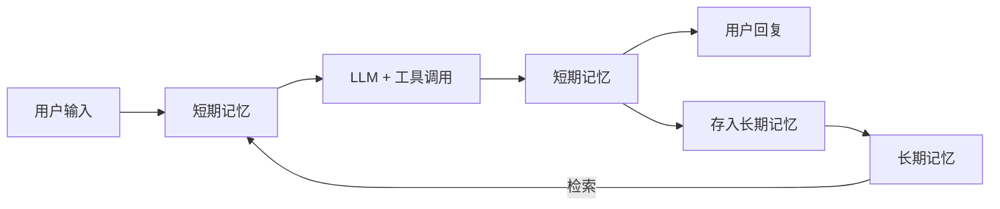

# 背景

记忆系统可以使 AI Agent 像人类一样，在单次对话中保持上下文连贯性（短期记忆），同时能够跨会话记住用户偏好、历史交互和领域知识（长期记忆）。
记忆使它们能够记住之前的互动、从反馈中学习，并适应用户的偏好。

# 记忆的定义

习惯上，可以将会话级别的历史消息称为短期记忆，把可以跨会话共享的信息称为长期记忆。

- 会话级记忆：用户和智能体 Agent 在一个会话中的多轮交互（user-query & response）
- 跨会话记忆：从用户和智能体 Agent 的多个会话中抽取的通用信息，可以跨会话辅助 Agent 推理

本质上两者并不是通过简单的时间维度进行的划分，从实践层面上以是否跨 Session 会话来进行区分。
长期记忆的信息从短期记忆中抽取提炼而来，根据短期记忆中的信息实时地更新迭代，而其信息又会参与到短期记忆中辅助模型进行个性化推理。

# Agent 框架集成记忆的通用模式

1. 推理前加载- 根据当前 user-query 从长期记忆中加载相关信息
2. 上下文注入- 从长期记忆中检索的信息加入当前短期记忆中辅助模型推理
3. 记忆更新- 短期记忆在推理完成后加入到长期记忆中
4. 信息处理- 长期记忆模块中结合 LLM+向量化模型进行信息提取和检索



# 短期记忆

短期记忆存储会话中产生的各类消息，包括用户输入、模型回复、工具调用及其结果等。
这些消息直接参与模型推理，实时更新，并受模型的 maxToken 限制。
当消息累积导致上下文窗口超出限制时，需要通过上下文工程策略（压缩、卸载、摘要等）进行处理，这也是上下文工程主要处理的部分。

### 短期记忆的核心特点：

- 存储会话中的所有交互消息（用户输入、模型回复、工具调用等）
- 直接参与模型推理，作为 LLM 的输入上下文
- 实时更新，每次交互都会新增消息
- 受模型 maxToken 限制，需要上下文工程策略进行优化

### 短期记忆的上下文工程策略

短期记忆直接参与 Agent 和 LLM 的交互，随着对话历史增长，上下文窗口会面临 token 限制和成本压力。
上下文工程策略旨在通过智能化的压缩、卸载和摘要技术，在保持信息完整性的同时，有效控制上下文大小。

需要说明的是，各方对上下文工程的概念和理解存在些许差异：

- 狭义的上下文工程特指对短期记忆（会话历史）中各种压缩、摘要、卸载等处理机制，主要解决上下文窗口限制和 token 成本问题；
- 广义的上下文工程则包括更广泛的上下文优化策略，如非运行态的模型选择、Prompt 优化工程、知识库构建、工具集构建等。

这些都是在模型推理前对上下文进行优化的手段，且这些因素都对模型推理结果有重要影响。

### 针对短期记忆的上下文处理，主要有以下几种策略：

1. 上下文缩减（Context Reduction） ：上下文缩减通过减少上下文中的信息量来降低 token 消耗，主要有两种方法：
   1. 保留预览内容：对于大块内容，只保留前 N 个字符或关键片段作为预览，原始完整内容被移除
   2. 总结摘要：使用 LLM 对整段内容进行总结摘要，保留关键信息，丢弃细节
2. 上下文卸载（Context Unloading） ：主要解决被缩减的内容是否可恢复的问题。当内容被缩减后，原始完整内容被卸载到外部存储（如文件系统、数据库等），消息中只保留最小必要的引用（如文件路径、UUID 等）。当需要完整内容时，可以通过引用重新加载。优势在于上下文更干净，占用更小，信息不丢，随取随用。适用于网页搜索结果、超长工具输出、临时计划等占 token 较多的内容。
3. 上下文隔离（Context Isolation）：通过多智能体架构，将上下文拆分到不同的子智能体中（类似单体拆分称多个微服务）。主智能体编写任务指令，发送给子智能体，子智能体的整个上下文仅由该指令组成。子智能体完成任务后返回结果，主智能体不关心子智能体如何执行，只需要结果。优势在于上下文小、开销低、简单直接。适用于任务有清晰简短的指令，只有最终输出才重要，如代码库中搜索特定片段。

### 策略选择原则

- 时间远近：近期消息通常更重要，需要优先保留；历史消息可以优先进行缩减或卸载；
- 数据类型：不同类型的消息（用户输入、模型回复、工具调用结果等）重要性不同，需要采用不同的处理策略；
- 信息可恢复性：对于需要完整信息的内容，应优先使用卸载策略；对于可以接受信息丢失的内容，可以使用缩减策略

# 长期记忆

长期记忆与短期记忆形成双向交互：一方面，长期记忆从短期记忆中提取“事实”、“偏好”、“经验”等有效信息进行存储（Record）；
另一方面，长期记忆中的信息会被检索并注入到短期记忆中，辅助模型进行个性化推理（Retrieve）。

要实现这两个核心流程，需要一下组件：

1. LLM 大模型：提取短期记忆中的有效信息（记忆的语义理解、抽取、决策和生成）；
2. Embedder 向量化：将文本转换为语义向量，支持相似性计算；
3. VectorStore 向量数据库：持久化存储记忆向量和元数据，支持高效语义检索；
4. GraphStore 图数据库：存储实体-关系知识图谱，支持复杂关系推理；
5. Reranker（重排序器）：对初步检索结果按语义相关性重新排序；
6. SQLite：记录所有记忆操作的审计日志，支持版本回溯；

### Record

```text
LLM 事实提取 → 信息向量化 → 向量存储 →（复杂关系存储）→ SQLite 操作日志
```

### Retrieve

```text
User query 向量化 → 向量数据库语义检索 → 图数据库关系补充 →（Reranker-LLM）→ 结果返回
```

### 与短期记忆的交互

- Record（写入）：从短期记忆的会话消息中提取有效信息，通过LLM进行语义理解和抽取，存储到长期记忆中
- Retrieve（检索）：根据当前用户查询，从长期记忆中检索相关信息，注入到短期记忆中作为上下文，辅助模型推理

### 实践中的实现方式

在 Agent 开发实践中，长期记忆通常是一个独立的第三方组件，因为其内部有相对比较复杂的流程（信息提取、向量化、存储、检索等）。
常见的长期记忆组件包括 Mem0、Zep、Memos、ReMe 等，这些组件提供了完整的 Record 和 Retrieve 能力，Agent 框架通过 API 集成这些组件。

### 信息组织维度

用户维度（个人记忆）：面向用户维度组织的实时更新的个人知识库

- 用户画像分析报告
- 个性化推荐系统，千人千面
- 处理具体任务时加载至短期记忆中

业务领域维度：沉淀的经验（包括领域经验和工具使用经验）

- 可沉淀至领域知识库
- 可通过强化学习微调沉淀至模型

### 长期记忆与 RAG 的区别

| 对比条目     | RAG                                                            | 长期记忆                                                                   |
| ------------ | -------------------------------------------------------------- | -------------------------------------------------------------------------- |
| **主要目的** | 为大模型提供外部知识，弥补训练数据的局限性（如时效性、专业性） | 为 AI Agent 记录并利用特定用户的历史交互信息，实现个性化、上下文连续的服务 |
| **服务对象** | 全体用户或任务                                                 | 特定用户或会话主体（高度个性化）                                           |
| **知识来源** | 结构化/非结构化文档（如 PDF、网页、数据库）                    | 用户与 Agent 的对话历史、行为日志等                                        |

技术层面的相似点：

1. 向量化存储：都将文本内容通过 Embedding 模型转为向量，存入向量数据库；
2. 相似性检索：在用户提问时，将当前 query 向量化，在向量库中检索 top-k 最相关的条目；
3. 注入上下文生成：将检索到的内容注入到模型交互上下文中，辅助 LLM 生成最终回答；

### 长期记忆的关键问题

一、准确性

记忆的准确性包含两个层面：

- 有效的记忆管理：需要具备智能的巩固、更新和遗忘机制，这主要依赖于记忆系统中负责信息提取的模型能力和算法设计；
- 记忆相关性的检索准确度：主要依赖于向量化检索&重排的核心能力；

核心挑战：

- 记忆的建模：需要完善强大的用户画像模型；
- 记忆的管理：基于用户画像建模算法，提取有效信息，设计记忆更新机制；
- 向量化相关性检索能力：提升检索准确率和相关性；

二、安全和隐私

记忆系统记住了大量用户隐私信息，如何防止数据中毒等恶意攻击，并保障用户隐私，是必须解决的问题。

核心挑战：

- 数据加密与访问控制
- 防止恶意数据注入
- 透明的数据管理机制
- 用户对自身数据的掌控权

三、多模态记忆

支持文本记忆、视觉、语音仍被孤立处理，如何构建统一的“多模态记忆空间”仍是未解难题。

核心挑战：

- 跨模态关联
- 与检索统一的多模态记忆表示
- 毫秒级响应能力

### 长期记忆开源产品对比

| 产品                | 开源时间  | 功能（记忆类型）               | LLM的作用           | 向量数据库                | 图数据库              |
| ------------------- | --------- | ------------------------------ | ------------------- | ------------------------- | --------------------- |
| **Mem0**            | 2023年7月 | ✅ 用户画像 + 领域记忆         | 记忆创建/更新/检索  | ✅ pgvector, Qdrant等多种 | ✅ Neo4j, Memgraph    |
| **Zep**             | 2023年初  | ✅ 用户画像 + 领域记忆         | 记忆提取 + 实体识别 | ✅ 支持                   | ✅ 时序知识图谱架构   |
| **MemOS**           | 2025年7月 | ✅ 用户画像 + 领域记忆         | 记忆提取 + 推理     | ⚠️ 可选支持，非必需       | ✅ NebulaGraph, Neo4j |
| **Memobase**        | 2025年1月 | ✅ 用户画像记忆<br>❌ 领域记忆 | 画像理解 + 更新     | ❌ 不依赖向量数据库       | ❌ 不依赖图数据库     |
| **AgentScope ReMe** | 2025年6月 | ✅ 用户画像 + 领域记忆         | 记忆管理 + 优化     | ✅ Chroma, Qdrant等多种   | ❌ 未明确提及         |
